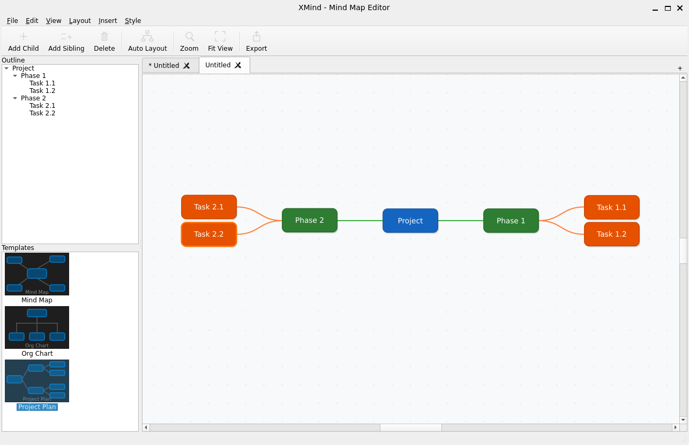

# XMind - Mind Map Editor

A desktop mind map editor built with C++ and Qt6. Create, edit, and organize hierarchical mind maps with an intuitive interface featuring tabbed editing, multiple layout styles, undo/redo, and theme support.

## Screenshots



## Features

- **Tabbed Editing** - Work on multiple mind maps simultaneously with drag-to-reorder tabs
- **Multiple Layouts** - Bilateral (balanced left/right), Top-Down (org chart), and Right-Tree (project plan) layouts
- **Auto Layout** - Automatically arrange nodes with `Ctrl+L`
- **Undo/Redo** - Full command-based undo/redo for add, remove, edit, move, and edge lock operations
- **Drag & Drop** - Reposition nodes and subtrees by dragging
- **Edge Locking** - Lock edges to prevent child node movement, with visual lock/unlock icons
- **File I/O** - Save and load mind maps in `.xmind` (JSON) format
- **Export** - Export to PNG (2x scaling), SVG, PDF, plain text, or Markdown
- **Import** - Import mind maps from indented text files
- **Templates** - Start from built-in templates (Mind Map, Org Chart, Project Plan) or a blank canvas
- **Themes** - Light and Dark mode with VS Code-inspired dark styling and system theme detection
- **Auto-Save** - Configurable automatic saving with 1-5 minute intervals
- **Outline Sidebar** - Tree-based outline view for quick navigation
- **Settings** - Configurable theme, fonts, auto-save, and editor preferences
- **Zoom & Pan** - Scroll wheel zoom, fit-to-view, and middle/right-click panning
- **Keyboard-Driven** - Comprehensive keyboard shortcuts for efficient editing

## Building

### Prerequisites

- C++17 compiler (GCC, Clang, or MSVC)
- CMake 3.16+
- Qt6 (Widgets, Svg, PrintSupport)

### Build Instructions

```bash
mkdir build && cd build
cmake ..
make
./xmind
```

### Windows Builds

```bash
# Static build (standalone executable)
./build-windows.sh static

# Shared build (executable + Qt DLLs in deploy/ folder)
./build-windows.sh shared
```

## Keyboard Shortcuts

| Shortcut            | Action               |
| ------------------- | -------------------- |
| `Enter`             | Add child node       |
| `Ctrl+Enter`        | Add sibling node     |
| `Del`               | Delete selected node |
| `F2` / Double-click | Edit node text       |
| `Ctrl+L`            | Auto layout          |
| `Ctrl+T`            | New tab              |
| `Ctrl+W`            | Close tab            |
| `Ctrl+N`            | New file             |
| `Ctrl+O`            | Open file            |
| `Ctrl+S`            | Save                 |
| `Ctrl+Shift+S`      | Save as              |
| `Ctrl+Z`            | Undo                 |
| `Ctrl+Y`            | Redo                 |
| `Ctrl++`            | Zoom in              |
| `Ctrl+-`            | Zoom out             |
| `Ctrl+0`            | Fit to view          |
| `Ctrl+,`            | Settings             |
| Scroll wheel        | Zoom                 |
| Middle/Right-drag   | Pan                  |

## Project Structure

```
xmind/
├── CMakeLists.txt
├── build-windows.sh
├── LICENSE
├── README.md
├── img/
│   └── Screenshot.png
└── src/
    ├── main.cpp              # Application entry point
    ├── MainWindow.h/cpp      # Main window with menus, toolbar, sidebar, auto-save
    ├── ThemeManager.h/cpp    # Centralized theme colors, stylesheets, icon generation
    ├── TabManager.h/cpp      # Tab bar and content stack management
    ├── FileManager.h/cpp     # File I/O, export, and import operations
    ├── MindMapScene.h/cpp    # Graphics scene managing nodes, edges, and layout algorithms
    ├── MindMapView.h/cpp     # Graphics view with zoom, pan, and grid background
    ├── NodeItem.h/cpp        # Node graphics item with text, colors, and hierarchy
    ├── EdgeItem.h/cpp        # Curved bezier edge connector with lock icons
    ├── Commands.h/cpp        # Undo/redo commands (add, remove, edit, move, toggle lock)
    ├── OutlineWidget.h/cpp   # Tree-based outline sidebar
    ├── StartPage.h/cpp       # Template gallery start page
    ├── AppSettings.h/cpp     # Settings singleton (theme, auto-save, fonts)
    └── SettingsDialog.h/cpp  # Settings dialog UI
```

## License

This project is licensed under the Apache License 2.0. See [LICENSE](LICENSE) for details.
