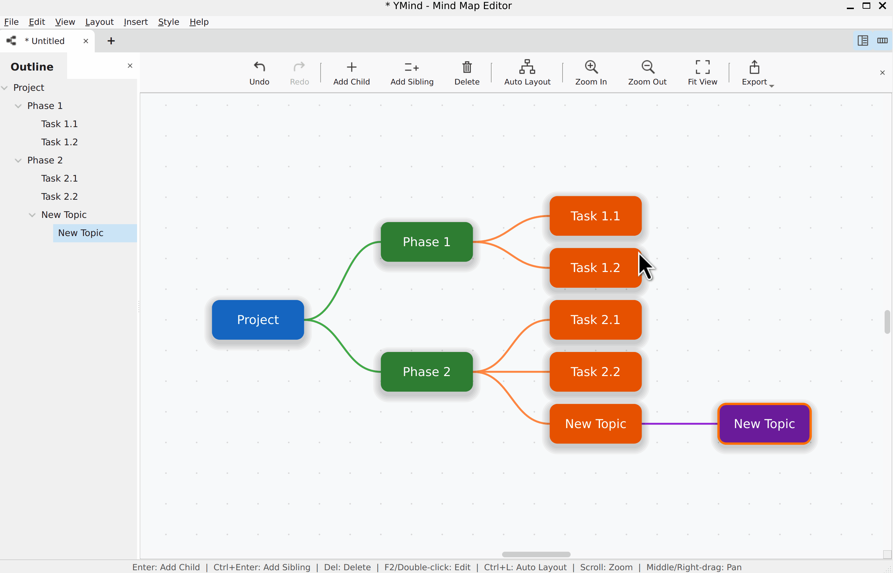
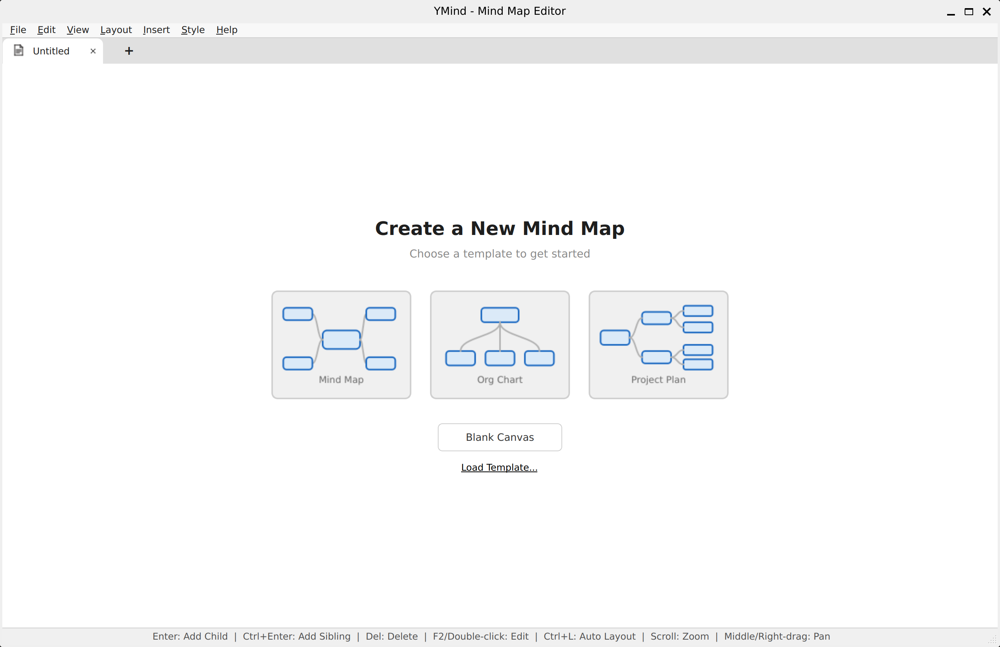
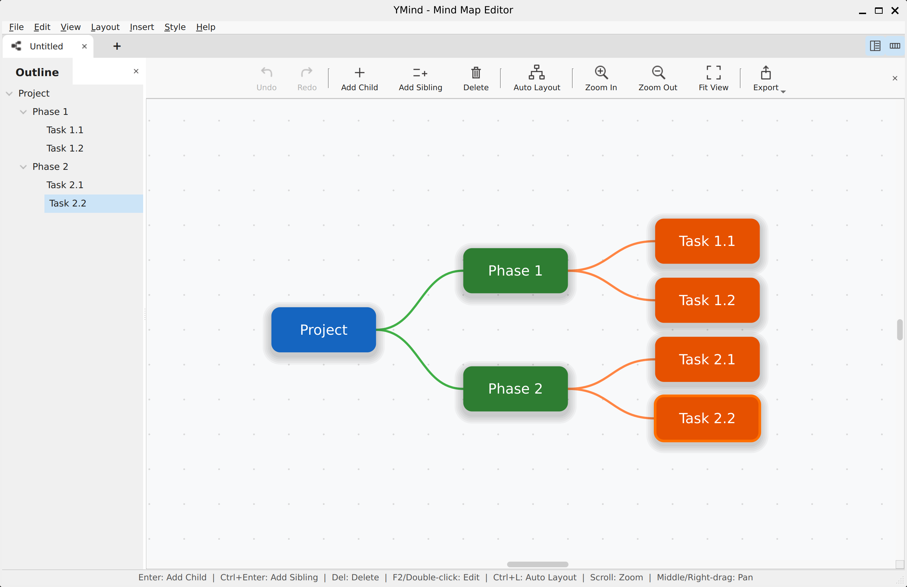
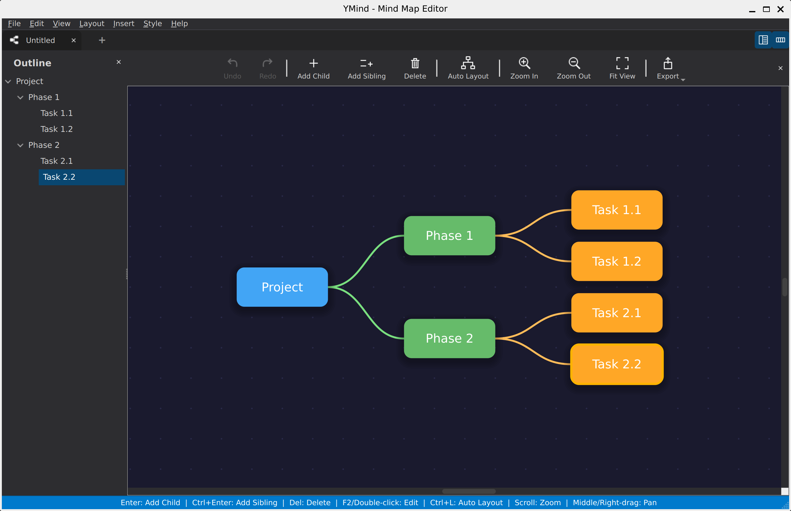

# YMind - Mind Map Editor

[简体中文](README_zh.md) | English

A desktop mind map editor built with C++ and Qt6. Create, edit, and organize hierarchical mind maps with an intuitive interface featuring tabbed editing, multiple layout styles, undo/redo, and theme support.

## Screenshots






## Features

- **Tabbed Editing** - Work on multiple mind maps simultaneously with drag-to-reorder tabs
- **Multiple Layouts** - Bilateral (balanced left/right), Top-Down (org chart), and Right-Tree (project plan) layouts
- **Auto Layout** - Automatically arrange nodes with `Ctrl+L`
- **Undo/Redo** - Full command-based undo/redo for add, remove, edit, and move operations
- **Drag & Drop** - Reposition nodes and subtrees by dragging
- **File I/O** - Save and load mind maps in `.ymind` (JSON) format
- **Export** - Export to PNG (2x scaling), SVG, PDF, plain text, or Markdown
- **Import** - Import mind maps from indented text files
- **Templates** - Start from built-in templates (Mind Map, Org Chart, Project Plan), load custom templates from JSON, or start with a blank canvas
- **Themes** - Light and Dark mode with system theme detection
- **Auto-Save** - Configurable automatic saving with 1-5 minute intervals
- **Outline Sidebar** - Tree-based outline view for quick navigation
- **Settings** - Configurable theme, fonts, auto-save, and editor preferences
- **Zoom & Pan** - Scroll wheel zoom, fit-to-view, and middle/right-click panning
- **Keyboard-Driven** - Comprehensive keyboard shortcuts for efficient editing
- **AI / MCP** - Ships with `ymind-cli`, a headless binary that doubles as a Model Context Protocol server. Lets Claude / Cursor / any MCP-compatible AI turn Markdown into a beautiful auto-laid-out mindmap. See the [setup guide](https://broccoli-97.github.io/xmind/#mcp).

## Headless rendering (CLI + MCP server)

Alongside the GUI, the build produces `ymind-cli` — a small companion binary for scripting and AI integration:

```bash
# Render Markdown to SVG/PNG
./build/ymind-cli render -i notes.md -o map.svg
./build/ymind-cli render -i notes.md -o map.png -f png --layout righttree --theme builtin.nord

# Stdin → stdout
cat notes.md | ./build/ymind-cli render -i - -o - -f svg > map.svg

# Run as a Model Context Protocol server (stdio)
./build/ymind-cli mcp
```

### Install as a Claude Code plugin (recommended)

YMind ships as a Claude Code plugin — two commands and you're done:

```
/plugin marketplace add broccoli-97/xmind
/plugin install ymind
```

Then ensure `ymind-cli` is on your PATH (one-time):

```bash
# After cmake --build build
sudo ln -s "$PWD/build/ymind-cli" /usr/local/bin/ymind-cli
# or, for a temporary session
export PATH="$PWD/build:$PATH"
```

Ask Claude: *"summarise this article as a mindmap, use the nord theme, save it to ~/Desktop"* — and it will. Full configuration steps for Claude Desktop and Cursor are on the [docs site](https://broccoli-97.github.io/xmind/#mcp).

## Building

### Prerequisites

- C++17 compiler (GCC, Clang, or MSVC)
- CMake 3.16+
- Qt6 (Widgets, Svg, PrintSupport)

### Build Instructions

```bash
mkdir build && cd build
cmake ..
make
./ymind
```

### Build Options

```bash
# Build with unit tests
cmake .. -DBUILD_TESTING=ON

# Build with clang-tidy static analysis
cmake .. -DENABLE_CLANG_TIDY=ON

# Run tests
ctest --output-on-failure
```

## Keyboard Shortcuts

| Shortcut            | Action               |
| ------------------- | -------------------- |
| `Enter`             | Add child node       |
| `Ctrl+Enter`        | Add sibling node     |
| `Del`               | Delete selected node |
| `F2` / Double-click | Edit node text       |
| `Ctrl+L`            | Auto layout          |
| `Ctrl+T`            | New tab              |
| `Ctrl+W`            | Close tab            |
| `Ctrl+N`            | New file             |
| `Ctrl+O`            | Open file            |
| `Ctrl+S`            | Save                 |
| `Ctrl+Shift+S`      | Save as              |
| `Ctrl+Z`            | Undo                 |
| `Ctrl+Y`            | Redo                 |
| `Ctrl++`            | Zoom in              |
| `Ctrl+-`            | Zoom out             |
| `Ctrl+0`            | Fit to view          |
| `Ctrl+,`            | Settings             |
| Scroll wheel        | Zoom                 |
| Middle/Right-drag   | Pan                  |

## Project Structure

```
ymind/
├── CMakeLists.txt
├── .clang-tidy             # clang-tidy configuration
├── LICENSE
├── README.md
├── resources/
│   ├── resources.qrc
│   └── theme.qss           # QSS stylesheet template
├── tests/                   # Qt Test unit tests
│   ├── CMakeLists.txt
│   ├── tst_TemplateDescriptor.cpp
│   ├── tst_LayoutStyle.cpp
│   ├── tst_TemplateRegistry.cpp
│   ├── tst_LayoutAlgorithmRegistry.cpp
│   ├── tst_AppSettings.cpp
│   └── tst_MindMapSceneSerialization.cpp
└── src/
    ├── main.cpp
    ├── core/                # Application infrastructure
    │   ├── MainWindow       # Main window, menus, toolbar, auto-save
    │   ├── FileManager      # File I/O, export, and import
    │   ├── Commands         # Undo/redo commands (add, remove, edit, move)
    │   ├── AppSettings      # Settings singleton (theme, auto-save, fonts)
    │   ├── SettingsDialog   # Settings dialog UI
    │   ├── TemplateDescriptor  # Template data structures and JSON serialization
    │   └── TemplateRegistry    # Template registration and lookup
    ├── scene/               # Graphics scene items
    │   ├── MindMapScene     # Scene managing nodes, edges, serialization
    │   ├── MindMapView      # View with zoom, pan, and grid background
    │   ├── NodeItem         # Node graphics item with floating shadow
    │   └── EdgeItem         # Curved bezier edge connector
    ├── layout/              # Auto-layout algorithms
    │   ├── ILayoutAlgorithm       # Abstract algorithm interface
    │   ├── LayoutAlgorithmBase    # Shared measure/place/refine phases
    │   ├── BilateralLayout        # Left/right balanced tree
    │   ├── TopDownLayout          # Top-down org chart
    │   ├── RightTreeLayout        # Right-expanding tree
    │   ├── LayoutAlgorithmRegistry  # Algorithm registry singleton
    │   ├── LayoutEngine           # Static layout facade
    │   └── LayoutStyle            # Enum and name conversions
    └── ui/                  # Widgets and theming
        ├── ThemeManager     # Theme color palette singleton
        ├── StyleSheetGenerator  # CSS stylesheet generation
        ├── TabManager       # Tab bar and content stack management
        ├── StartPage        # Template gallery start page
        ├── OutlineWidget    # Tree-based outline sidebar
        └── IconFactory      # SVG icon and preview generation
```

## License

This project is licensed under the Apache License 2.0. See [LICENSE](LICENSE) for details.
