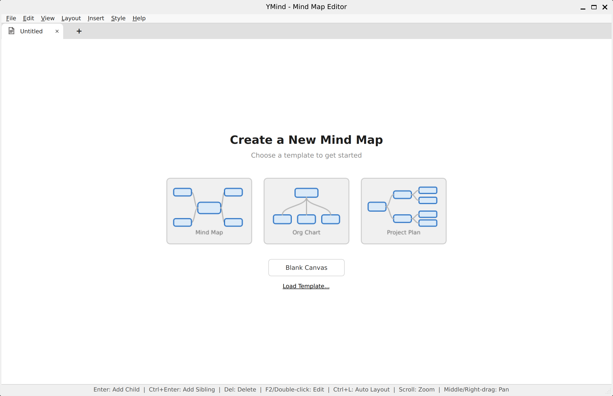
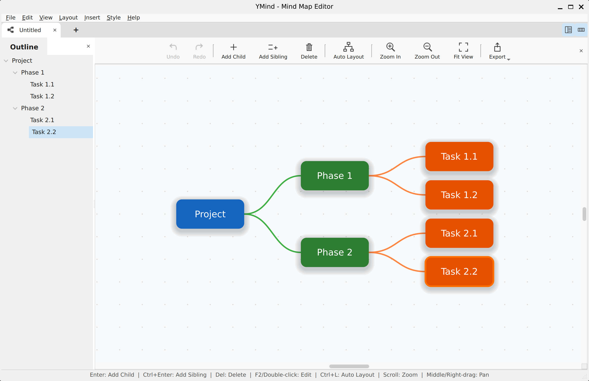
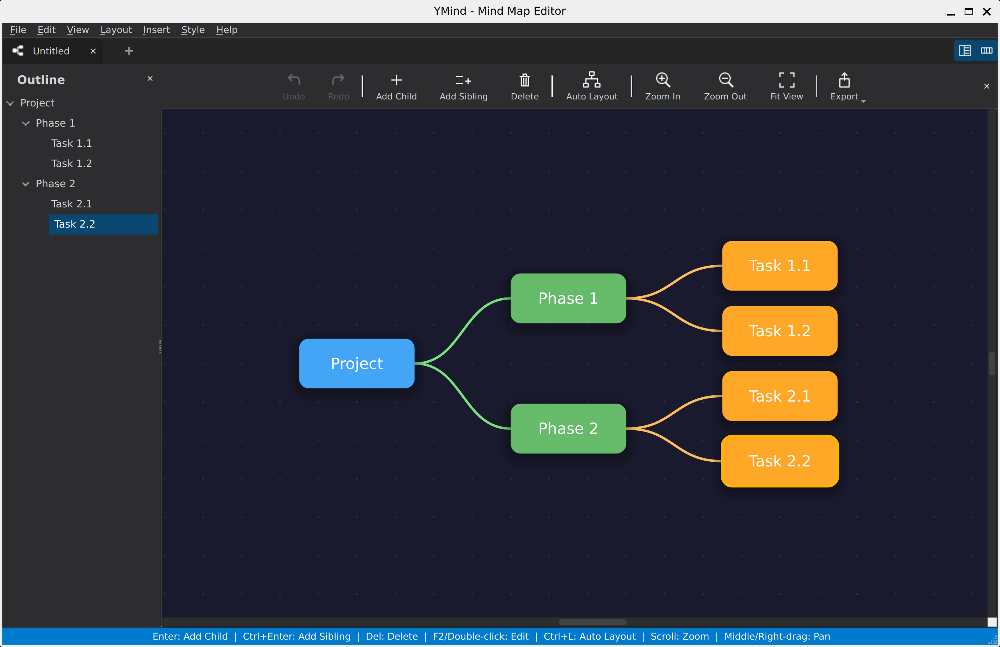
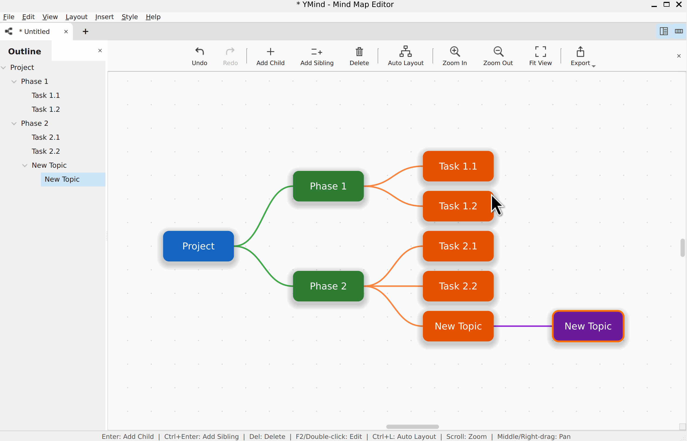

# YMind - 思维导图编辑器

一款使用 C++ 和 Qt6 构建的桌面思维导图编辑器。支持创建、编辑和组织层次化的思维导图，提供直观的界面，具备多标签编辑、多种布局样式、撤销/重做以及主题切换等功能。

## 截图






## 功能特性

- **多标签编辑** - 同时编辑多个思维导图，支持拖拽排序标签页
- **多种布局** - 双向布局（左右平衡）、自顶向下布局（组织架构图）、右侧树布局（项目计划）
- **自动布局** - 使用 `Ctrl+L` 自动排列节点
- **撤销/重做** - 基于命令模式的完整撤销/重做，支持添加、删除、编辑和移动操作
- **拖放操作** - 通过拖拽重新定位节点和子树
- **文件读写** - 以 `.ymind`（JSON）格式保存和加载思维导图
- **导出** - 导出为 PNG（2 倍缩放）、SVG、PDF、纯文本或 Markdown
- **导入** - 从缩进文本文件导入思维导图
- **模板** - 内置模板（思维导图、组织架构图、项目计划），支持从 JSON 加载自定义模板，或从空白画布开始
- **主题** - 浅色和深色模式，支持系统主题检测
- **自动保存** - 可配置的自动保存，间隔 1-5 分钟
- **大纲侧边栏** - 树形大纲视图，便于快速导航
- **设置** - 可配置主题、字体、自动保存和编辑器偏好
- **缩放与平移** - 滚轮缩放、适应视图、中键/右键拖拽平移
- **键盘驱动** - 全面的键盘快捷键，高效编辑

## 构建

### 前置要求

- C++17 编译器（GCC、Clang 或 MSVC）
- CMake 3.16+
- Qt6（Widgets、Svg、PrintSupport）

### 构建步骤

```bash
mkdir build && cd build
cmake ..
make
./ymind
```

### 构建选项

```bash
# 启用单元测试构建
cmake .. -DBUILD_TESTING=ON

# 启用 clang-tidy 静态分析构建
cmake .. -DENABLE_CLANG_TIDY=ON

# 运行测试
ctest --output-on-failure
```

## 键盘快捷键

| 快捷键              | 操作               |
| ------------------- | ------------------ |
| `Enter`             | 添加子节点         |
| `Ctrl+Enter`        | 添加同级节点       |
| `Del`               | 删除选中节点       |
| `F2` / 双击         | 编辑节点文本       |
| `Ctrl+L`            | 自动布局           |
| `Ctrl+T`            | 新建标签页         |
| `Ctrl+W`            | 关闭标签页         |
| `Ctrl+N`            | 新建文件           |
| `Ctrl+O`            | 打开文件           |
| `Ctrl+S`            | 保存               |
| `Ctrl+Shift+S`      | 另存为             |
| `Ctrl+Z`            | 撤销               |
| `Ctrl+Y`            | 重做               |
| `Ctrl++`            | 放大               |
| `Ctrl+-`            | 缩小               |
| `Ctrl+0`            | 适应视图           |
| `Ctrl+,`            | 设置               |
| 滚轮                | 缩放               |
| 中键/右键拖拽       | 平移               |

## 项目结构

```
ymind/
├── CMakeLists.txt
├── .clang-tidy             # clang-tidy 配置
├── LICENSE
├── README.md
├── README_zh.md
├── resources/
│   ├── resources.qrc
│   └── theme.qss           # QSS 样式表模板
├── tests/                   # Qt Test 单元测试
│   ├── CMakeLists.txt
│   ├── tst_TemplateDescriptor.cpp
│   ├── tst_LayoutStyle.cpp
│   ├── tst_TemplateRegistry.cpp
│   ├── tst_LayoutAlgorithmRegistry.cpp
│   ├── tst_AppSettings.cpp
│   └── tst_MindMapSceneSerialization.cpp
└── src/
    ├── main.cpp
    ├── core/                # 应用基础设施
    │   ├── MainWindow       # 主窗口、菜单、工具栏、自动保存
    │   ├── FileManager      # 文件读写、导出和导入
    │   ├── Commands         # 撤销/重做命令（添加、删除、编辑、移动）
    │   ├── AppSettings      # 设置单例（主题、自动保存、字体）
    │   ├── SettingsDialog   # 设置对话框界面
    │   ├── TemplateDescriptor  # 模板数据结构和 JSON 序列化
    │   └── TemplateRegistry    # 模板注册和查找
    ├── scene/               # 图形场景项
    │   ├── MindMapScene     # 管理节点、边、序列化的场景
    │   ├── MindMapView      # 支持缩放、平移和网格背景的视图
    │   ├── NodeItem         # 带浮动阴影的节点图形项
    │   └── EdgeItem         # 贝塞尔曲线边连接器
    ├── layout/              # 自动布局算法
    │   ├── ILayoutAlgorithm       # 抽象算法接口
    │   ├── LayoutAlgorithmBase    # 共享的测量/放置/优化阶段
    │   ├── BilateralLayout        # 左右平衡树
    │   ├── TopDownLayout          # 自顶向下组织架构图
    │   ├── RightTreeLayout        # 右侧展开树
    │   ├── LayoutAlgorithmRegistry  # 算法注册单例
    │   ├── LayoutEngine           # 静态布局门面
    │   └── LayoutStyle            # 枚举和名称转换
    └── ui/                  # 部件和主题
        ├── ThemeManager     # 主题颜色调色板单例
        ├── StyleSheetGenerator  # CSS 样式表生成
        ├── TabManager       # 标签栏和内容栈管理
        ├── StartPage        # 模板画廊起始页
        ├── OutlineWidget    # 树形大纲侧边栏
        └── IconFactory      # SVG 图标和预览生成
```

## 许可证

本项目基于 Apache License 2.0 许可证。详情请参阅 [LICENSE](LICENSE)。
